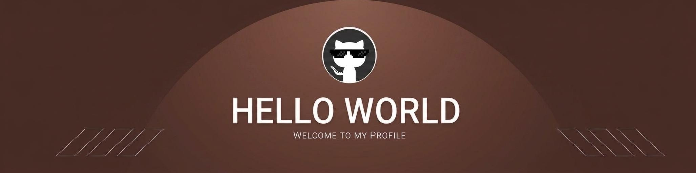

## Hi there 👋

<!--
**SaraMarani/SaraMarani** is a ✨ _special_ ✨ repository because its `README.md` (this file) appears on your GitHub profile.

Here are some ideas to get you started:

- 🔭 I’m currently working on ...
- 🌱 I’m currently learning ...
- 👯 I’m looking to collaborate on ...
- 🤔 I’m looking for help with ...
- 💬 Ask me about ...
- 📫 How to reach me: ...
- 😄 Pronouns: ...
- ⚡ Fun fact: ...
-->

<!--Banner-->

<!--Header Name-->
#  ɪ'ᴍ SARA! 
  
<!--Night Owl image-->

  

<!--Start Intro-->               

- 🔭 I’m currently working on academic projects in computer vision and image processing. 
- 🌱 I’m currently learning deep learning and exploring AI applications. 
- 👯 I’m looking to collaborate on beginner-friendly AI and computer vision projects. 
- 🤔 I’m looking for help with building real-world AI solutions and improving my development skills. 
- 💬 Ask me about Python, image processing, and machine learning. 
- 📫 How to reach me: msarani2001@gmail.com 
- 😄 Pronouns: She/Her 
- ⚡ Fun fact: I enjoy turning ideas into practical AI projects.

<!--End Intro-->

<!--Profile Count Badge-->

---
 
 

<!--Languages and Tools Section-->       
<h2 align="center">🎯 Tᴇᴄʜ sᴛᴀᴄᴋ 🎯</h2> 

  
  
  
  
  
  
  
  
  

<table>
  <tr>
    <td width="50%" align="center">
      <picture>
        <source media="(prefers-color-scheme: dark)" srcset="./Skills_Animation_Dark.gif">
        <source media="(prefers-color-scheme: light)" srcset="./Skills_Animation_White.gif">
        
      </picture>
    </td>
    <td width="50%" align="left">
      <h3>Current Learning</h3>
      
Deepening my knowledge in Machine Learning and AI.

      
Exploring advanced Django and state management techniques.

    </td>
  </tr>
</table>

 
 

<!--Trophies Section-->   
<h2 align="center">🏆 Gɪᴛʜᴜʙ Tʀᴏᴘʜɪᴇs 🏆</h2>

  <a href="https://github.com/SaraMarani">
    <picture>
      <source media="(prefers-color-scheme: dark)" srcset="https://github-profile-trophy-ruddy.vercel.app/?username=SaraMarani&no-bg=true&row=2&column=6&margin-w=20&margin-h=20&theme=slateorange"
      <source media="(prefers-color-scheme: light)" srcset="https://github-profile-trophy-ruddy.vercel.app/?username=SaraMarani&no-bg=true&row=2&column=6&margin-w=20&margin-h=20">
      
    </picture>
  </a>

  

 

<!--Github stats Table--> 
<h2 align="center">📊 Gɪᴛʜᴜʙ Sᴛᴀᴛs 📊</h2>

<table width="100%">
  <tr>
    <td width="50%">
      <h3 align="center"><strong>Gɪᴛʜᴜʙ Sᴛᴀᴛs</strong></h3>
      

        
      

    </td>
    <td width="50%">
      <h3 align="center"><strong>Sᴛʀᴇᴀᴋ Sᴛᴀᴛs</strong></h3>
      

        
      

    </td>
  </tr>
  <tr>
    <td width="50%">
      <h3 align="center"><strong>Lᴀᴛᴇsᴛ Pʀᴏᴊᴇᴄᴛ</strong></h3>
      

        
      

    </td>
    <td width="50%">
      <h3 align="center"><strong>Tᴏᴘ Cᴏɴᴛʀɪʙᴜᴛɪᴏɴs</strong></h3>
      

        
      

    </td>
  </tr>
</table>
 

<!--Contribution Graph-->
<h2 align="center">📈 Cᴏɴᴛʀɪʙᴜᴛɪᴏɴ Gʀᴀᴘʜ 📈</h2>

    

---

<!--Dynamic Quote card updates everyday at 12 PM--> 
<h2 align="center">🌟 Tʜᴏᴜɢʜᴛ ᴏғ ᴛʜᴇ Dᴀʏ 🌟</h2>

<!--STARTS_HERE_QUOTE_CARD-->

    

<!--ENDS_HERE_QUOTE_CARD-->

<!--Contact Section--> 

<h2 align="center">🤝 Cᴏɴɴᴇᴄᴛ Wɪᴛʜ Mᴇ 🤝 </h2>

  

 

<!--Buy me a coffee-->

<!--Footer--> 

  

